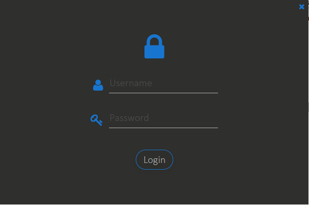
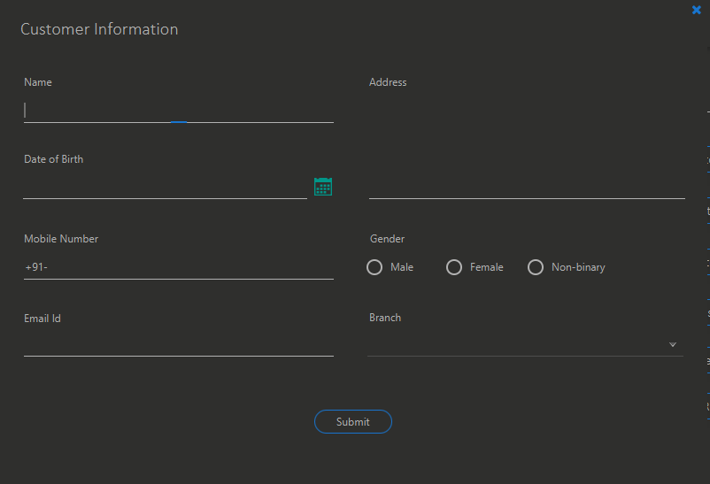
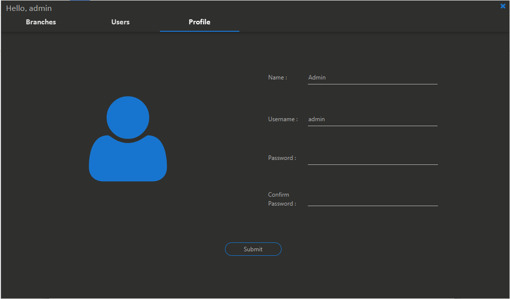

# TitanX Gym Management 
TitanX Fitness 360 is a software designed for a gymnasium. It manages customer data in a very easy and intuitive way. There are 2 main users of this software – Receptionists and members of management. The receptionists will use this software to manage customer data and generate invoices. The management will use this software to set standards and generate reports to analyse the customer data. It provides features like dynamic search, email notifications to clients, pdf invoice and report generation.

